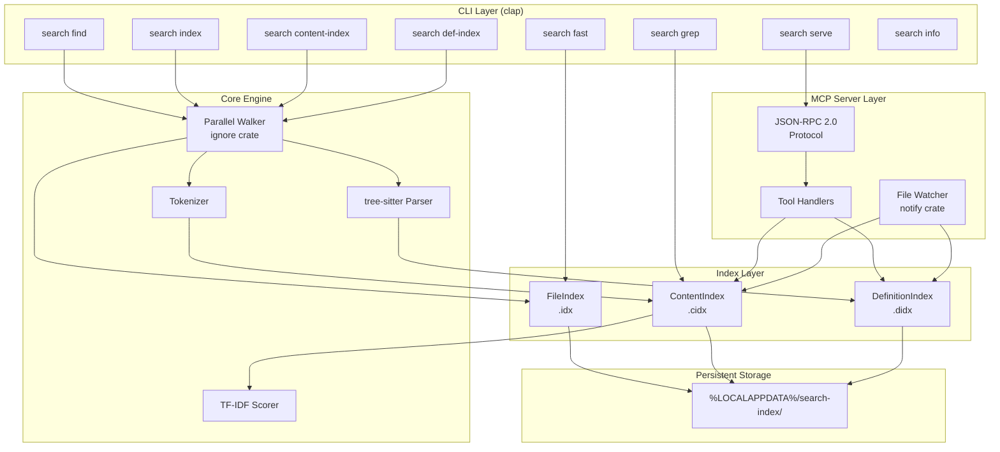
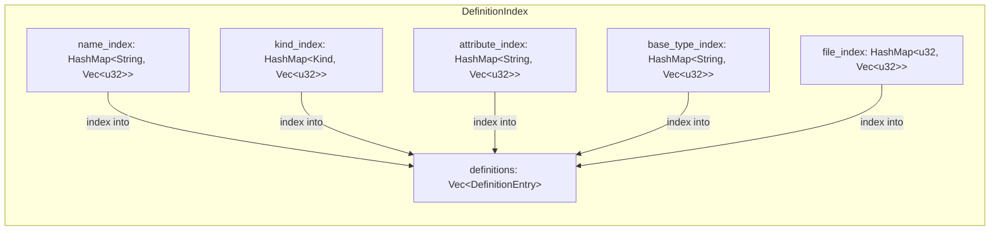
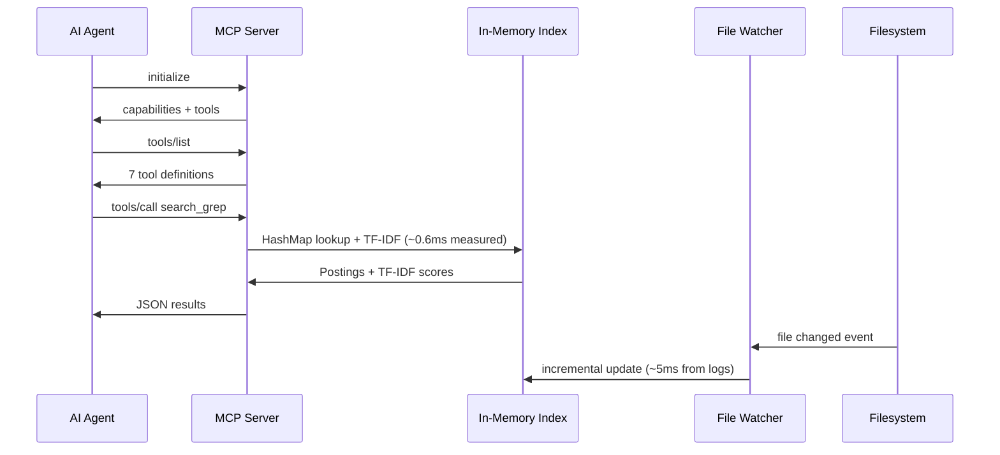
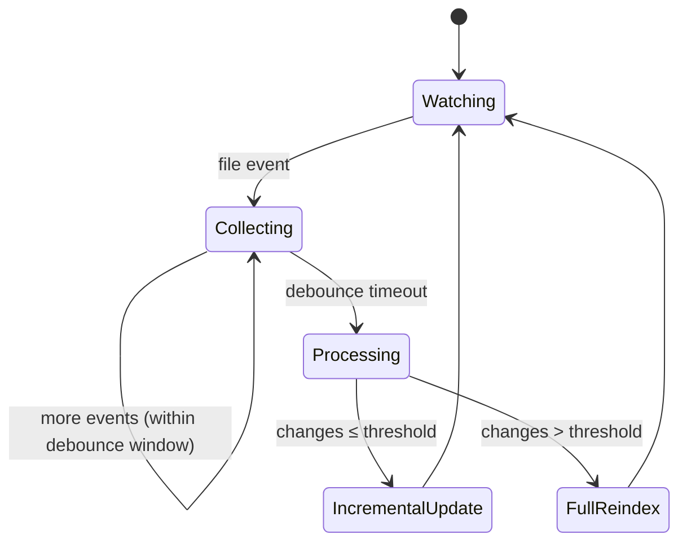
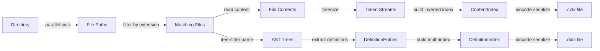
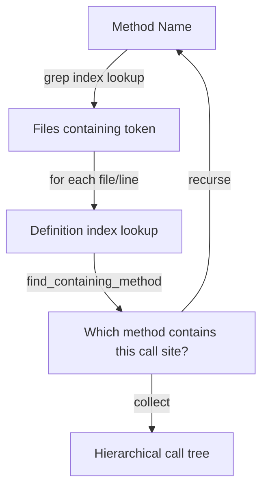

# Architecture

> High-performance code search engine with inverted indexing, AST-based definition extraction, and an MCP server for AI agent integration.

## System Overview



## Component Architecture

### 1. Index Layer

Three independent index types, each optimized for a different query pattern:

| Index             | File    | Data Structure                  | Lookup                  | Purpose                  |
| ----------------- | ------- | ------------------------------- | ----------------------- | ------------------------ |
| `FileIndex`       | `.idx`  | `Vec<FileEntry>`                | O(n) scan               | File name search         |
| `ContentIndex`    | `.cidx` | `HashMap<String, Vec<Posting>>` | O(1) per token          | Full-text content search |
| `DefinitionIndex` | `.didx` | Multi-index `HashMap` set       | O(1) per name/kind/attr | Structural code search   |

All indexes are:

- **Serialized with bincode** — fast binary format, zero-copy deserialization
- **Stored deterministically** — file path is `hash(canonical_dir [+ extensions])` as hex
- **Self-describing** — each index embeds its root directory, creation timestamp, and staleness threshold
- **Independent** — can be built, loaded, or deleted without affecting other indexes

### 2. Content Index (Inverted Index)

The core data structure. Maps every token to the files and line numbers where it appears.

```
Forward view (conceptual):
  file_0.cs → [using, system, class, httpclient, getasync]
  file_1.cs → [namespace, test, httpclient, postasync]

Inverted view (actual storage):
  "httpclient" → [Posting{file_id:0, lines:[5,12]}, Posting{file_id:1, lines:[3]}]
  "getasync"   → [Posting{file_id:0, lines:[15]}]
```

**Key properties:**

- Token lookup is a single `HashMap::get()` — O(1)
- Each `Posting` stores both `file_id` and `lines` — enables line-level results without file I/O
- File paths stored in a separate `Vec<String>` indexed by `file_id` — deduplication
- `file_token_counts[file_id]` stores per-file token count for TF normalization

**Optional watch-mode fields:**

- `forward: HashMap<u32, Vec<String>>` — reverse mapping for incremental removal
- `path_to_id: HashMap<PathBuf, u32>` — path-based file lookup for watcher events

### 3. Definition Index (AST Index)

Structural code search using tree-sitter AST parsing. Five cross-referencing indexes over the same `Vec<DefinitionEntry>`:



Each `DefinitionEntry` contains: `name`, `kind`, `file_id`, `line_start..line_end`, `parent` (containing class), `signature`, `modifiers`, `attributes`, `base_types`.

The multi-index design enables compound queries: "find all public async methods in classes that implement `IQueryHandler` and have `[ServiceProvider]` attribute" — resolved via set intersection of index lookups.

### 4. MCP Server

JSON-RPC 2.0 event loop over stdio. Designed for AI agent integration (VS Code Copilot, Roo, Claude).



**Design decisions:**

- **Stdio transport** — no HTTP overhead, direct pipe from VS Code process manager
- **Single-threaded event loop** — JSON-RPC is sequential; index reads use `RwLock` for watcher concurrency
- **Indexes held in `Arc<RwLock<T>>`** — watcher thread writes, server thread reads
- **All logging to stderr** — stdout is exclusively for JSON-RPC protocol messages

### 5. File Watcher

OS-level filesystem notifications (via `notify` crate / `ReadDirectoryChangesW` on Windows) with debounced batch processing.



**Incremental update path** (per file, ~5ms):

1. Read file content from disk
2. Remove old tokens from inverted index (via forward index)
3. Re-tokenize file
4. Add new tokens to inverted index
5. Update forward index
6. If definition index is loaded: re-parse with tree-sitter, update definition entries

**Bulk reindex path** (when changes > `bulk_threshold`, default 100):

- Full rebuild of content index from scratch
- Triggered by git checkout, branch switch, large merges

## Data Flow

### Index Build Pipeline



### Query Pipeline


**TF-IDF scoring:**

```
score(term, file) = TF(term, file) × IDF(term)

TF  = occurrences_in_file / total_tokens_in_file
IDF = ln(total_files / files_containing_term)
```

Multi-term: scores are summed across matching terms. Files matching more terms rank higher naturally.

### Call Tree Pipeline (search_callers)



This replaces 7+ sequential grep + read_file calls with a single request by combining the content index (where does this token appear?) with the definition index (which method spans this line range?).

## Module Structure

```
src/
├── main.rs              # CLI, index data structures, build/search logic
│                          FileIndex, ContentIndex, tokenizer, all CLI commands
├── definitions.rs       # DefinitionIndex, tree-sitter parsing (C# + SQL)
│                          AST walking, definition extraction, incremental updates
└── mcp/
    ├── mod.rs            # Module exports
    ├── protocol.rs       # JSON-RPC 2.0 types (request, response, error)
    ├── server.rs         # Stdio event loop, method dispatch
    ├── handlers.rs       # Tool implementations (grep, find, fast, callers, defs)
    └── watcher.rs        # File watcher, incremental index updates
```

**Dependency direction:** `main.rs` ← `mcp/*` ← `definitions.rs`. No circular dependencies. MCP layer depends on core index types but core has no knowledge of MCP.

## Supported Languages

| Language   | Parser                  | Definition Types                                                                                           |
| ---------- | ----------------------- | ---------------------------------------------------------------------------------------------------------- |
| C# (.cs)   | tree-sitter-c-sharp     | class, interface, struct, enum, record, method, constructor, property, field, delegate, event, enum member |
| SQL (.sql) | tree-sitter-sequel-tsql | stored procedure, table, view, function, user-defined type, column, index                                  |

Content indexing (tokenizer) is language-agnostic — works with any text file.
