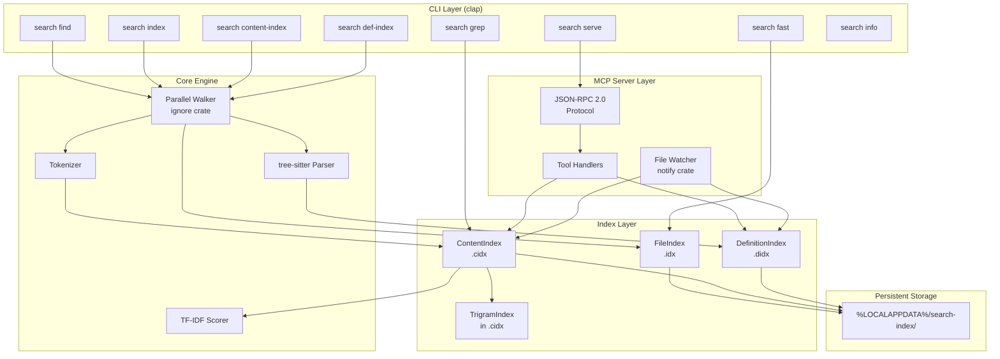
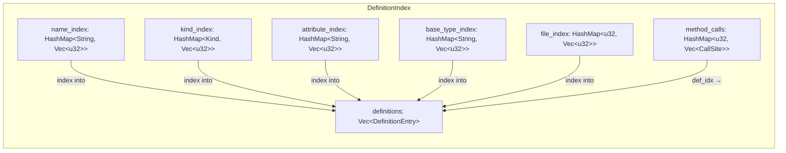
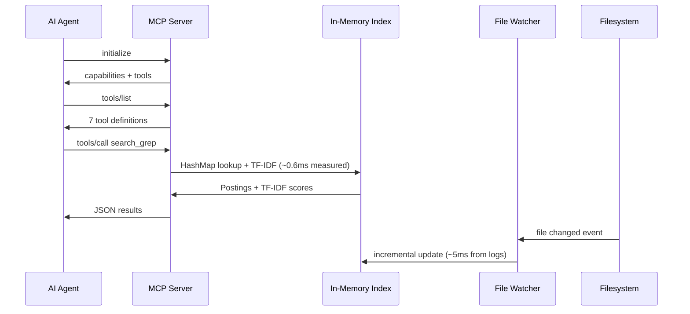
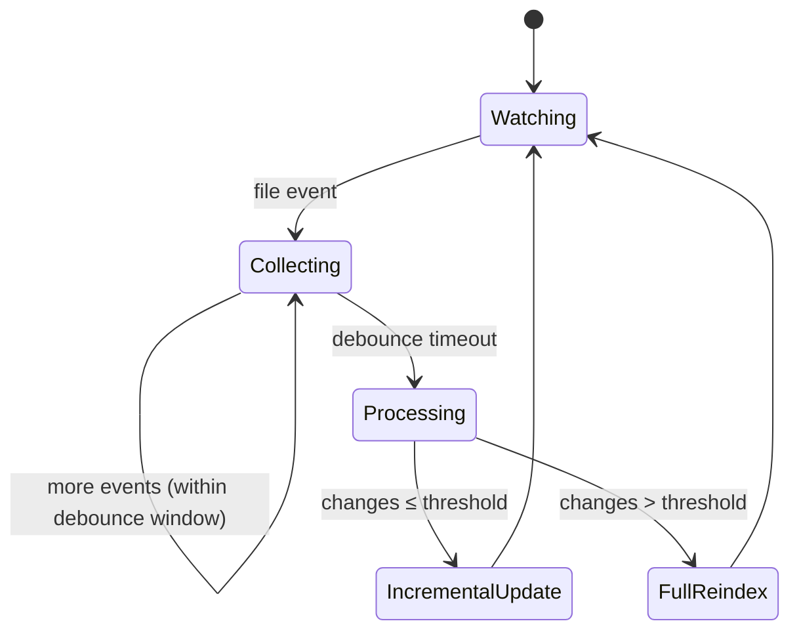
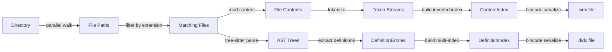
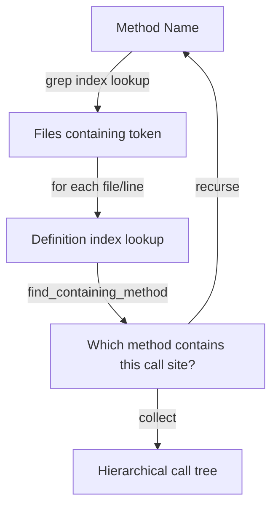
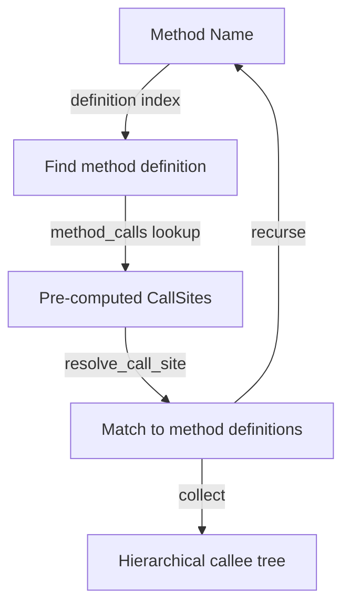

# Architecture

> High-performance code search engine with inverted indexing, AST-based definition extraction, and an MCP server for AI agent integration.

## System Overview



## Component Architecture

### 1. Index Layer

Three independent index types, each optimized for a different query pattern:

| Index             | File    | Data Structure                  | Lookup                  | Purpose                  |
| ----------------- | ------- | ------------------------------- | ----------------------- | ------------------------ |
| `FileIndex`       | `.idx`  | `Vec<FileEntry>`                | O(n) scan               | File name search         |
| `ContentIndex`    | `.cidx` | `HashMap<String, Vec<Posting>>` + `TrigramIndex` | O(1) per token, O(1) substring via trigrams | Full-text content search + substring search |
| `DefinitionIndex` | `.didx` | Multi-index `HashMap` set       | O(1) per name/kind/attr | Structural code search   |

All indexes are:

- **Serialized with bincode** — fast binary format, zero-copy deserialization
- **LZ4 frame-compressed on disk** — all index files (`.idx`, `.cidx`, `.didx`) are wrapped in LZ4 frame compression via the `lz4_flex` crate (`FrameEncoder`/`FrameDecoder`). Files start with a 4-byte `LZ4S` magic header for format identification. Compression is streaming (no intermediate full buffer in memory). Typical compression ratio is ~4–5× (e.g., 697 MB → ~150 MB for content indexes). Legacy uncompressed files are still supported — auto-detected on load by checking the magic header for backward compatibility.
- **Stored deterministically** — file path is `hash(canonical_dir [+ extensions])` as hex
- **Self-describing** — each index embeds its root directory, creation timestamp, and staleness threshold
- **Independent** — can be built, loaded, or deleted without affecting other indexes

### 2. Content Index (Inverted Index)

The core data structure. Maps every token to the files and line numbers where it appears. **Language-agnostic** — the tokenizer splits on non-alphanumeric boundaries and lowercases, requiring no language grammar. Works with any text file.

```
Forward view (conceptual):
  file_0.cs → [using, system, class, httpclient, getasync]
  file_1.cs → [namespace, test, httpclient, postasync]

Inverted view (actual storage):
  "httpclient" → [Posting{file_id:0, lines:[5,12]}, Posting{file_id:1, lines:[3]}]
  "getasync"   → [Posting{file_id:0, lines:[15]}]
```

**Key properties:**

- Token lookup is a single `HashMap::get()` — O(1)
- Each `Posting` stores both `file_id` and `lines` — enables line-level results without file I/O
- File paths stored in a separate `Vec<String>` indexed by `file_id` — deduplication
- `file_token_counts[file_id]` stores per-file token count for TF normalization

**Optional watch-mode fields:**

- `forward: HashMap<u32, Vec<String>>` — reverse mapping for incremental removal
- `path_to_id: HashMap<PathBuf, u32>` — path-based file lookup for watcher events

### 3. Definition Index (AST Index)

**Language-specific** structural code search using tree-sitter AST parsing (C# and TypeScript/TSX). Six cross-referencing indexes over the same `Vec<DefinitionEntry>`, plus a pre-computed call graph:



Each `DefinitionEntry` contains: `name`, `kind`, `file_id`, `line_start..line_end`, `parent` (containing class), `signature`, `modifiers`, `attributes`, `base_types`.

Each `CallSite` contains: `method_name`, `receiver_type` (resolved via field/constructor type declarations, DI-aware), `line`.

The `method_calls` map stores pre-computed call sites for each method/constructor, extracted during `def-index` build by walking AST `invocation_expression` and `member_access_expression` nodes. This enables instant callee lookups (direction "down") without runtime file I/O.

The multi-index design enables compound queries: "find all public async methods in classes that implement `IQueryHandler` and have `[ServiceProvider]` attribute" — resolved via set intersection of index lookups.

### 4. Trigram Index (Substring Search)

The trigram index enables fast substring matching within indexed tokens. It solves the compound-identifier problem: when the tokenizer produces a single token like `databaseconnectionfactory`, a search for `DatabaseConnection` would fail with exact token lookup. The trigram index makes this possible in ~0.07ms.

#### Data Structure

```rust
pub struct TrigramIndex {
    /// All unique tokens from the inverted index, sorted alphabetically.
    pub tokens: Vec<String>,
    /// Trigram → sorted vec of token indices (into `tokens` vec).
    pub trigram_map: HashMap<String, Vec<u32>>,
}
```

The `TrigramIndex` is a field of `ContentIndex` (not `Option` — always built):

```rust
pub struct ContentIndex {
    // ... existing fields ...
    pub trigram: TrigramIndex,        // always populated
    pub trigram_dirty: bool,          // lazy rebuild flag for watcher
}
```

#### How It Works

A **trigram** is a 3-character sliding window over a string:

```
Token:    "httpclient"
Trigrams: "htt", "ttp", "tpc", "pcl", "cli", "lie", "ien", "ent"
```

The trigram index maps each trigram to all tokens containing it:

```
"htt" → [httpclient, httphandler, httpcontext, ...]
"cli" → [httpclient, clickhandler, clientbase, ...]
```

**Searching for substring** `"httpcli"`:

1. Generate query trigrams: `"htt"`, `"ttp"`, `"tpc"`, `"pcl"`, `"cli"`
2. Intersect posting lists (sorted merge) — only tokens in ALL lists survive
3. Verify candidates with `token.contains("httpcli")` — filters trigram false positives
4. Look up verified tokens in the main inverted index → file postings + TF-IDF scoring

#### Index Build

The trigram index is built automatically at the end of `build_content_index()` in [`index.rs`](../src/index.rs):


Build time is ~200ms for 754K tokens — negligible compared to the main index build (~7–16s).

#### Memory Overhead

| Component               | Size       |
| ----------------------- | ---------- |
| `tokens: Vec<String>`   | ~11 MB     |
| `trigram_map` values     | ~40 MB     |
| `trigram_map` keys       | ~0.1 MB    |
| HashMap overhead         | ~5 MB      |
| **Total trigram index**  | **~56 MB** |

This is ~23% overhead on top of the 242 MB content index.

#### Watcher Integration (Lazy Rebuild)

Rather than performing complex incremental updates to the trigram index on every file change, the watcher uses a **lazy rebuild strategy**:

1. On file change: watcher updates the main inverted index incrementally (as before) and sets `trigram_dirty = true`
2. On next substring search: if `trigram_dirty`, the trigram index is rebuilt from scratch (~200ms), then `trigram_dirty = false`
3. On bulk reindex (changes > threshold): trigram is rebuilt alongside the main index

This keeps the watcher fast (no O(n) index shifting) while amortizing the trigram rebuild cost.

### 5. MCP Server

JSON-RPC 2.0 event loop over stdio. Designed for AI agent integration (VS Code Copilot, Roo, Claude).



**Design decisions:**

- **Stdio transport** — no HTTP overhead, direct pipe from VS Code process manager
- **Async startup** — event loop starts immediately with empty indexes; pre-built indexes load synchronously from disk (< 3s), otherwise build in background threads. `AtomicBool` flags (`content_ready`, `def_ready`) gate search tools — they return "index is building" until ready. `initialize`, `tools/list`, `search_help`, `search_info`, and `search_find` work immediately.
- **Single-threaded event loop** — JSON-RPC is sequential; index reads use `RwLock` for watcher concurrency
- **Indexes held in `Arc<RwLock<T>>`** — watcher thread writes, server thread reads; background build thread writes once at completion
- **All logging to stderr** — stdout is exclusively for JSON-RPC protocol messages
- **Response size truncation** — all tool responses are capped at ~32KB (~8K tokens) to prevent filling LLM context windows. Progressive truncation: cap line arrays → remove lineContent → cap matchedTokens → remove lines → reduce file count. Truncation metadata (`responseTruncated`, `truncationReason`, `hint`) is injected into the summary so the LLM knows to narrow its query.

### 6. File Watcher

OS-level filesystem notifications (via `notify` crate / `ReadDirectoryChangesW` on Windows) with debounced batch processing.



**Incremental update path** (per file, ~50-100ms):

1. Read file content from disk
2. Remove old postings from inverted index (brute-force scan of all tokens for the file_id — no forward index needed, saves ~1.5 GB RAM)
3. Re-tokenize file
4. Add new tokens to inverted index
5. If definition index is loaded: re-parse with tree-sitter, update definition entries

**Bulk reindex path** (when changes > `bulk_threshold`, default 100):

- Full rebuild of content index from scratch
- Triggered by git checkout, branch switch, large merges

## Data Flow

### Index Build Pipeline



### Query Pipeline


**TF-IDF scoring:**

```
score(term, file) = TF(term, file) × IDF(term)

TF  = occurrences_in_file / total_tokens_in_file
IDF = ln(total_files / files_containing_term)
```

Multi-term: scores are summed across matching terms. Files matching more terms rank higher naturally.

### Relevance Ranking

Results from `search_definitions`, `search_fast`, and `search_grep` (phrase mode) are sorted by relevance using a multi-key tiered sort algorithm. This ensures that exact matches appear first, followed by prefix matches, then substring/contains matches — critical for AI agents that rely on the first 5–10 results.

#### Algorithm: `best_match_tier()`

Shared function in `utils.rs` that classifies a name against search terms (case-insensitive):

| Tier | Match Type | Example (query: `UserService`) |
|------|-----------|-------------------------------|
| 0    | **Exact** — name equals a search term | `UserService` |
| 1    | **Prefix** — name starts with a search term | `UserServiceFactory`, `UserServiceHelper` |
| 2    | **Contains** — name contains a search term | `IUserService`, `BaseUserService` |

For comma-separated multi-term queries, the **best** (lowest) tier across all terms is used.

#### Sort Keys by Tool

**`search_definitions`** (when `name` filter is active, non-regex):

```
1. Match tier:   exact(0) > prefix(1) > contains(2)
2. Kind:         class/interface/enum/struct/record(0) > method/property/field(1)
3. Name length:  shorter > longer
4. Alphabetical: deterministic tiebreaker
```

**`search_fast`** (file name search):

```
1. Match tier:   exact(0) > prefix(1) > contains(2)  — by filename stem (no extension)
2. Stem length:  shorter > longer
3. Full path:    alphabetical tiebreaker
```

**`search_grep` phrase mode**: sorted by occurrence count (descending).

**Not ranked**: `search_grep` token/substring mode (uses TF-IDF), `search_find` (filesystem walk order), regex mode in `search_definitions` (no "exact match" semantics).

#### Design Decisions

- **No numeric score in JSON** — LLM agents use result **order**, not absolute score values. No `relevanceScore` field is emitted.
- **Kind is a tiebreaker, not a primary key** — a method `GetUser` (exact, tier 0) always outranks a class `GetUserService` (prefix, tier 1). Kind only matters within the same tier.
- **Case-insensitive comparison** — `best_match_tier()` lowercases both the name and terms internally, so ranking works correctly regardless of input casing.

See [TODO-relevance-ranking.md](TODO-relevance-ranking.md) for the full design rationale and comparison of alternatives.

### Call Tree Pipeline (search_callers)

**Direction "up" (find callers):**


**Direction "down" (find callees):**


Direction "up" combines the content index (where does this token appear?) with the definition index (which method spans this line range?). Supports `class` parameter for disambiguation and `resolveInterfaces` for DI-aware tracing. When a `class` filter is specified, file candidates are pre-computed via exact token lookup + **trigram substring matching** (`collect_substring_file_ids`) to handle field naming patterns like `m_orderProcessor`, `_userService` where the class name appears as a substring of a larger token.

Direction "down" uses the pre-computed call graph — zero runtime file I/O. Call sites are extracted during `def-index` build with field type resolution (DI constructor parameter types → field types → receiver types).

## Indexing Triggers — When Does Indexing Happen?

A single consolidated reference for all indexing scenarios. For detailed internals, see [Storage Model](storage.md), [Concurrency](concurrency.md), and [CLI Reference](cli-reference.md).

### Full Index Build

| Trigger | What Happens | Indexes Affected | Time |
|---------|-------------|-----------------|------|
| `search content-index -d DIR -e EXT` | Full parallel walk + tokenization | ContentIndex (`.cidx`) | ~7–16s |
| `search def-index -d DIR -e EXT` | Full parallel walk + tree-sitter parse | DefinitionIndex (`.didx`) | ~16–32s |
| `search index -d DIR` | Full parallel walk | FileIndex (`.idx`) | ~2–4s |
| MCP server first start (no index on disk) | Background thread builds indexes; tools return "index is building" until ready | ContentIndex + DefinitionIndex (if `--definitions`) | Same as above |
| `search_reindex` (MCP tool) | Full rebuild + reload in-memory | ContentIndex | ~7–16s |
| `search_reindex_definitions` (MCP tool) | Full rebuild + reload in-memory | DefinitionIndex | ~16–32s |
| Watcher batch > `--bulk-threshold` (default: 100) | Full rebuild from scratch (faster than 100+ incremental updates) | ContentIndex + DefinitionIndex | ~7–32s |

### Incremental Update (Watcher)

| Trigger | What Happens | Indexes Affected | Time |
|---------|-------------|-----------------|------|
| File saved in IDE | Watcher detects change after debounce window (`--debounce-ms`, default 500ms), updates inverted index + re-parses AST | ContentIndex + DefinitionIndex | ~50–100ms per file |
| File created | Same as file save — added to both indexes | ContentIndex + DefinitionIndex | ~50–100ms |
| File deleted | Postings purged from inverted index (brute-force scan); definitions removed from def index | ContentIndex + DefinitionIndex | ~50–100ms |

### Lazy / On-Demand Rebuild

| Trigger | What Happens | Indexes Affected | Time |
|---------|-------------|-----------------|------|
| Substring search after file watcher update | `trigram_dirty` flag → trigram index rebuilt from inverted index on next `search_grep` with `substring=true` | TrigramIndex (in-memory, part of ContentIndex) | ~200ms |
| `search fast` with stale FileIndex | Auto-rebuild if `--auto-reindex true` (default) | FileIndex | ~2–4s |
| `search grep` with stale ContentIndex | Auto-rebuild if `--auto-reindex true` (default) | ContentIndex | ~7–16s |

### Load From Disk (No Rebuild)

| Trigger | What Happens | Time |
|---------|-------------|------|
| MCP server start (index exists on disk) | Synchronous load of LZ4-compressed bincode files | < 3s |
| `search grep` / `search fast` (index exists, not stale) | Load from disk | < 3s |

### What Does NOT Trigger Re-indexing

| Scenario | Why |
|----------|-----|
| Upgrading `search.exe` binary (runtime logic changes only) | Index format unchanged → existing `.cidx` / `.didx` files are fully compatible |
| Upgrading `search.exe` binary (parser changes — new definition types, new call site patterns) | Old index loads fine but may have stale/incomplete data → **manual `search_reindex_definitions`** recommended |
| Upgrading `search.exe` binary (index format changes — e.g., new field added to struct) | Bincode deserialization fails → index is rebuilt automatically on next server start |
| Restarting VS Code / MCP server | Index loads from disk (if saved); no rebuild |
| Opening a different VS Code workspace | Each workspace has its own MCP server instance with its own index |

### Graceful Shutdown — Saving Incremental Changes

When the MCP server shuts down (stdin closes), it saves both in-memory indexes to disk. This preserves all incremental watcher updates that were only held in memory. On next startup, the saved indexes are loaded — no rebuild needed for changes made during the previous session.

## Module Structure

```
src/
├── lib.rs                    # Public types: FileEntry, FileIndex, ContentIndex, Posting
│                               tokenize(), clean_path() — shared by binary and benchmarks
├── main.rs                   # Entry point (~30 lines): mod declarations, re-exports, fn main()
├── main_tests.rs             # Integration tests for CLI commands
├── index.rs                  # Index storage: save/load/build for FileIndex and ContentIndex
│                               index_dir(), *_path_for(), build_index(), build_content_index()
├── error.rs                  # SearchError enum (thiserror) — unified error type
├── tips.rs                   # Best-practices guide text for search_help / CLI tips
│
├── cli/                      # CLI layer: argument parsing + command implementations
│   ├── mod.rs                # Cli struct, Commands enum, cmd_find/fast/grep dispatch
│   ├── args.rs               # All Args structs (FindArgs, IndexArgs, ContentIndexArgs, etc.)
│   ├── info.rs               # cmd_info, cmd_info_json
│   └── serve.rs              # cmd_serve — MCP server setup and launch
│
├── definitions/              # AST-based code definition index (tree-sitter)
│   ├── mod.rs                # build_definition_index() + re-exports
│   ├── types.rs              # DefinitionKind, DefinitionEntry, DefinitionIndex, CallSite
│   ├── parser_csharp.rs      # C# AST parsing: walk/extract functions (~30 helpers)
│   ├── parser_sql.rs         # SQL AST parsing (retained, currently disabled)
│   ├── storage.rs            # save/load/find definition index + def_index_path_for()
│   ├── incremental.rs        # update_file_definitions, remove_file_definitions
│   ├── definitions_tests.rs  # General definition tests (12 tests)
│   ├── definitions_tests_csharp.rs   # C# parser tests (19 tests)
│   └── definitions_tests_typescript.rs # TypeScript parser tests (32 tests)
│
└── mcp/                      # MCP server layer
    ├── mod.rs                # Module exports
    ├── protocol.rs           # JSON-RPC 2.0 types (request, response, error)
    ├── server.rs             # Stdio event loop, method dispatch, graceful shutdown
    ├── watcher.rs            # File watcher, incremental index updates
    └── handlers/             # Tool implementations (one file per tool)
        ├── mod.rs            # tool_definitions() + dispatch_tool() + reindex handlers
        ├── grep.rs           # handle_search_grep + phrase/substring helpers
        ├── find.rs           # handle_search_find
        ├── fast.rs           # handle_search_fast
        ├── definitions.rs    # handle_search_definitions + body injection
        ├── callers.rs        # handle_search_callers + caller/callee tree builders
        ├── utils.rs          # validate_search_dir, sorted_intersect, metrics helpers
        ├── handlers_tests.rs           # General handler tests (77 tests)
        ├── handlers_tests_csharp.rs    # C# handler tests (31 tests)
        └── handlers_tests_typescript.rs # TypeScript handler tests (placeholder)
```

**Dependency direction:** `cli/*` → `index.rs` → `lib.rs` (types). `mcp/*` → `index.rs` + `definitions/*`. No circular dependencies. MCP layer depends on core index types but core has no knowledge of MCP. `main.rs` delegates to `cli::run()`.

## Language Support

The engine has two layers with **different language coverage**:

| Layer | Tools | Language Support | How it works |
| ----- | ----- | ---------------- | ------------ |
| **Content search** | `search grep`, `content-index`, `search_grep` (MCP) | **Any text file** — language-agnostic | Splits text on non-alphanumeric boundaries, lowercases tokens, builds an inverted index. No language grammar needed. Works equally well with C#, Rust, Python, JS/TS, XML, JSON, Markdown, config files, etc. |
| **AST / structural search** | `search def-index`, `search_definitions`, `search_callers` (MCP) | **C#-specific** (SQL parser retained but disabled) | Uses tree-sitter to parse source into an AST, extracts classes, methods, interfaces, call sites. Requires a language-specific grammar. |

### AST Parser Status

| Language   | Parser                  | Definition Types                                                                                           | Status |
| ---------- | ----------------------- | ---------------------------------------------------------------------------------------------------------- | ------ |
| C# (.cs)   | tree-sitter-c-sharp     | class, interface, struct, enum, record, method, constructor, property, field, delegate, event, enum member | ✅ Active |
| SQL (.sql) | *(disabled)*            | stored procedure, table, view, function, user-defined type, column, index                                  | ⏸️ Disabled — `tree-sitter-sequel-tsql` 0.4 requires language version 15, incompatible with tree-sitter 0.24 (supports 13-14). Parsing code is retained for future use. |

> **Key takeaway:** You can use `content-index` / `search_grep` on **any** codebase regardless of language. Only `def-index` / `search_definitions` / `search_callers` require a supported tree-sitter grammar (currently C#).
