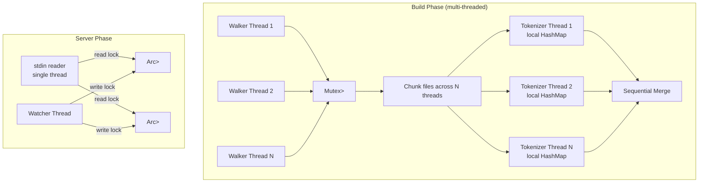
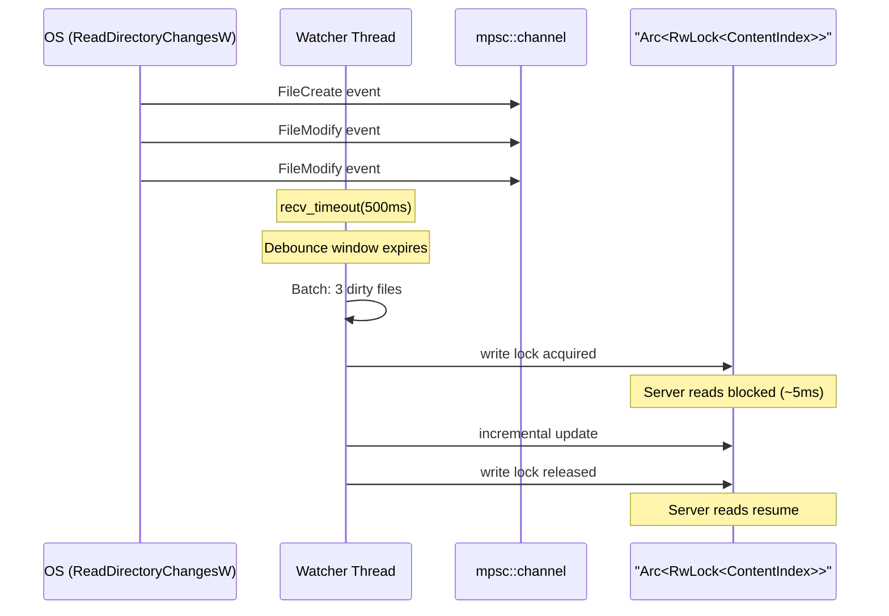

# Concurrency Model

## Overview

The system uses three distinct concurrency strategies depending on the operation phase:

| Phase        | Strategy                                     | Primitives                                            | Why                                |
| ------------ | -------------------------------------------- | ----------------------------------------------------- | ---------------------------------- |
| Index build  | Thread pool (parallel walk + parallel parse) | `WalkBuilder::build_parallel()`, `std::thread::scope` | CPU-bound, embarrassingly parallel |
| MCP server   | Single-threaded event loop                   | Sequential stdin line reads                           | JSON-RPC is inherently sequential  |
| File watcher | Dedicated OS thread + shared state           | `Arc<RwLock<T>>`, `mpsc::channel`                     | Must not block the event loop      |



## Phase 1: Parallel Index Build

### File Walk (ignore crate)

The `ignore` crate (from ripgrep) provides `WalkBuilder::build_parallel()` which spawns N threads, each walking a subtree of the directory. Results are collected via a `Mutex<Vec<T>>`:

```rust
let entries: Mutex<Vec<FileEntry>> = Mutex::new(Vec::new());

builder.build_parallel().run(|| {
    Box::new(move |result| {
        // Each thread pushes to shared vec
        entries.lock().unwrap().push(entry);
        ignore::WalkState::Continue
    })
});
```

**Lock contention:** Minimal. Each thread holds the mutex only for ~100ns (one `Vec::push`). With 24 threads and ~49K files, the mutex is acquired ~2K times per thread. The `ignore` crate's internal work distribution ensures threads process different directory subtrees, so lock acquisitions are spread over time.

### Content Index Build

Both file walk and tokenization are parallelized. After the parallel walk collects `Vec<(path, content)>`, the files are chunked and tokenized in parallel using `std::thread::scope`:

```
[Parallel Walk] → Vec<(path, content)> → [Parallel Tokenize: chunk files across N threads]
                                           → per-thread local HashMap
                                           → [Sequential Merge: combine local indexes]
```

```rust
let num_tok_threads = thread_count.max(1);
let tok_chunk_size = file_count.div_ceil(num_tok_threads).max(1);

let chunk_results: Vec<_> = std::thread::scope(|s| {
    let handles: Vec<_> = file_data.chunks(tok_chunk_size)
        .enumerate()
        .map(|(chunk_idx, chunk)| {
            let base_file_id = (chunk_idx * tok_chunk_size) as u32;
            s.spawn(move || {
                let mut local_index: HashMap<String, Vec<Posting>> = HashMap::new();
                // tokenize each file in chunk into local_index
            })
        }).collect();
    handles.into_iter().map(|h| h.join().unwrap()).collect()
});

// Sequential merge: ~50ms for 57M tokens
for (local_files, local_counts, local_index, local_total) in chunk_results {
    for (token, postings) in local_index {
        index.entry(token).or_default().extend(postings);
    }
}
```

**Design:** Each thread builds a completely independent local `HashMap<String, Vec<Posting>>` — no shared mutable state, no locks during tokenization. The merge step is sequential but fast (~50ms) because it only moves pre-built `Vec<Posting>` entries. Memory overhead is bounded: each thread's local index is a subset of the global index, and the merge transfers ownership rather than cloning.

**Benchmark (65K files, 57M tokens, 24-core CPU):** Parallel tokenization reduced content index build from 44s to 22s (2× speedup). The merge step is <1% of total time.

### Definition Index Build

Definition parsing IS parallelized because tree-sitter parsing is CPU-intensive (~16-32s for ~48K files depending on CPU):

```rust
let chunks: Vec<Vec<(u32, String)>> = files.chunks(chunk_size).collect();

std::thread::scope(|s| {
    for chunk in chunks {
        s.spawn(move || {
            let mut cs_parser = tree_sitter::Parser::new();
            // TS/TSX parsers are lazy-initialized only when needed
            let mut ts_parser: Option<Parser> = None;
            let mut tsx_parser: Option<Parser> = None;

            for (file_id, path) in chunk {
                match extension {
                    "cs" => parse_csharp(&mut cs_parser, ...),
                    "ts" => {
                        let p = ts_parser.get_or_insert_with(|| make_ts_parser());
                        parse_typescript(p, ...);
                    }
                    "tsx" => {
                        let p = tsx_parser.get_or_insert_with(|| make_tsx_parser());
                        parse_typescript(p, ...);
                    }
                }
            }
        });
    }
});
// Merge: sequential, ~50ms for ~846K definitions + ~2.4M call sites
```

**Key details:**

- tree-sitter `Parser` is `!Send` (contains internal mutable state). Each thread creates its own parser instance. This is intentional — tree-sitter parsers reuse internal memory allocations across parse calls, making per-thread parsers more efficient than a shared pool.
- **Lazy parser initialization:** TS/TSX parsers are created via `Option<Parser>` + `get_or_insert_with()` only when a thread encounters a file with that extension. For C#-only projects (the common case), TypeScript grammars are never loaded, saving ~2s per parser per thread. The `def_exts` parameter in `serve.rs` filters to the intersection of `--ext` and supported languages (`cs`, `ts`, `tsx`), so unnecessary grammars are never even considered.

## Phase 2: MCP Server Event Loop

The server uses a deliberately simple single-threaded model:

```rust
for line in stdin.lock().lines() {
    let request: JsonRpcRequest = serde_json::from_str(&line)?;
    let response = handle_request(&ctx, &request.method, &request.params, id);
    writeln!(stdout, "{}", serde_json::to_string(&response)?);
}
```

**Why not async/tokio?**

- MCP over stdio is inherently sequential — one request at a time on stdin
- Each query takes ~0.6ms (HashMap lookup + TF-IDF scoring, measured) — async overhead would exceed query time
- No I/O multiplexing needed — single input source (stdin), single output (stdout)
- Adding tokio would increase binary size and compile time significantly

**Read lock acquisition:** Each query acquires a read lock on the index. Multiple concurrent reads are allowed by `RwLock`, but since we're single-threaded, there's never actual read-read contention. The lock exists solely to synchronize with the watcher thread.

## Phase 3: File Watcher

The watcher runs on a dedicated OS thread spawned at server startup:



### Debounce Strategy

File events are collected into a `HashSet<PathBuf>` (deduplicating rapid saves of the same file) and processed in batch after the debounce window:

```rust
loop {
    match rx.recv_timeout(Duration::from_millis(debounce_ms)) {
        Ok(event) => {
            // Collect into dirty_files / removed_files sets
            dirty_files.insert(path);
        }
        Err(Timeout) => {
            // Process batch
            if dirty_files.len() + removed_files.len() > bulk_threshold {
                // Full reindex
            } else {
                // Incremental update
            }
        }
    }
}
```

### Lock Holding Duration

The write lock is held for the entire batch, not per-file. This minimizes lock acquisition overhead and ensures atomic batch updates:

| Batch Size | Lock Duration      | Impact on Queries |
| ---------- | ------------------ | ----------------- |
| 1 file     | ~5ms               | Imperceptible     |
| 10 files   | ~50ms              | Brief pause       |
| 100 files  | Full reindex (~1s) | Noticeable pause  |
| >100 files | Full reindex (~1s) | Noticeable pause  |

The bulk threshold (default: 100) triggers full reindex instead of incremental updates for large batches (git checkout, branch switch). Full reindex is actually faster than 100+ individual incremental updates because it avoids the forward-index cleanup overhead.

### Dual Index Updates

When `--definitions` is enabled, the watcher updates both indexes in sequence:

```rust
// Content index update
match index.write() {
    Ok(mut idx) => {
        for path in &dirty_clean { update_file_in_index(&mut idx, path); }
    }
}

// Definition index update
if let Some(ref def_idx) = def_index {
    match def_idx.write() {
        Ok(mut idx) => {
            for path in &dirty_clean { update_file_definitions(&mut idx, path); }
        }
    }
}
```

**Important:** The two indexes are updated sequentially, not atomically. There's a brief window where the content index is updated but the definition index is stale. This is acceptable because:

1. The window is <5ms per file
2. Queries that use both indexes (search_callers) will see slightly stale definition data, which at worst means a caller might be missing from the tree until the next update cycle
3. True atomicity would require either a single lock for both indexes (reducing read concurrency) or a transaction log (complexity not justified)

## Thread Safety Guarantees

| Data              | Owner                          | Synchronization                             | Invariant                                                                                |
| ----------------- | ------------------------------ | ------------------------------------------- | ---------------------------------------------------------------------------------------- |
| `ContentIndex`    | `Arc<RwLock<ContentIndex>>`    | Read: server thread. Write: watcher thread. | Forward index + inverted index always consistent within a single write lock acquisition. |
| `DefinitionIndex` | `Arc<RwLock<DefinitionIndex>>` | Same as ContentIndex.                       | Multi-indexes (name, kind, attr, etc.) always consistent within a single write.          |
| stdin/stdout      | MCP server thread (exclusive)  | No sharing.                                 | All JSON-RPC I/O on single thread.                                                       |
| stderr            | Any thread                     | OS-level line buffering.                    | Log lines may interleave but each `eprintln!` is atomic per line.                        |

## Potential Issues and Mitigations

### RwLock Poisoning

If the watcher thread panics while holding a write lock, the `RwLock` becomes poisoned. All subsequent read/write attempts will fail. Current behavior: the server logs an error and continues operating with the last good index state. The only recovery is restarting the server.

### Watcher Thread Crash

If the watcher thread panics (e.g., out of memory during reindex), the `_watcher` handle is dropped, which stops the file notifications. The server continues operating with a stale index. Detection: no `[watcher]` log messages after a file change.

### Backpressure

If the server is processing a long query (e.g., `search_callers` with depth=10), incoming file events queue up in the `mpsc::channel`. The channel is unbounded, so events are never lost. They'll be processed in the next debounce window after the query completes.
