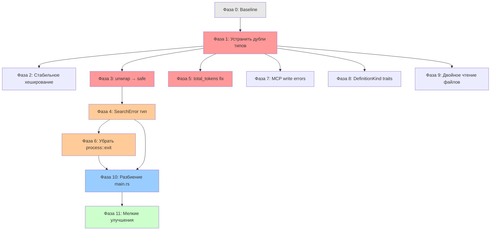

# План рефакторинга — Search Engine

## Содержание

1. [Философия и принципы](#1-философия-и-принципы)
2. [Фаза 0: Подготовка и baseline](#2-фаза-0-подготовка-и-baseline)
3. [Фаза 1: Устранение дублирования типов (lib.rs ↔ main.rs)](#3-фаза-1-устранение-дублирования-типов)
4. [Фаза 2: Стабильное хеширование путей индексов](#4-фаза-2-стабильное-хеширование-путей-индексов)
5. [Фаза 3: Безопасная обработка ошибок (unwrap → Result)](#5-фаза-3-безопасная-обработка-ошибок)
6. [Фаза 4: Собственный тип ошибок SearchError](#6-фаза-4-собственный-тип-ошибок)
7. [Фаза 5: Корректность инкрементального обновления (total_tokens)](#7-фаза-5-корректность-инкрементального-обновления)
8. [Фаза 6: Устранение process::exit в бизнес-логике](#8-фаза-6-устранение-processexit)
9. [Фаза 7: Корректная обработка ошибок записи в MCP сервере](#9-фаза-7-корректная-обработка-ошибок-записи-в-mcp-сервере)
10. [Фаза 8: Реализация стандартных трейтов для DefinitionKind](#10-фаза-8-стандартные-трейты-для-definitionkind)
11. [Фаза 9: Устранение двойного чтения файлов в phrase search](#11-фаза-9-устранение-двойного-чтения-файлов)
12. [Фаза 10: Разбиение main.rs на модули](#12-фаза-10-разбиение-mainrs-на-модули)
13. [Фаза 11: Мелкие улучшения (clippy, style, #[must_use])](#13-фаза-11-мелкие-улучшения)
14. [Порядок выполнения и зависимости](#14-порядок-выполнения-и-зависимости)
15. [Чеклист для каждой фазы](#15-чеклист-для-каждой-фазы)

---

## 1. Философия и принципы

**Главное правило: каждая фаза — это отдельный коммит (или PR), после которого:**

- `cargo build` проходит без ошибок
- `cargo test` проходит полностью (0 failures)
- `cargo clippy` не показывает новых warnings
- `cargo bench` компилируется (бенчмарки не ломаются)

**Порядок фаз выбран по принципу:**

1. Сначала — то, что влияет на корректность (баги, потеря данных)
2. Затем — то, что предотвращает панику в рантайме
3. Затем — архитектурные улучшения
4. В конце — стилистические изменения

**Каждая фаза включает:**

- Описание проблемы
- Варианты решения (если есть)
- Рекомендуемое решение с обоснованием
- Конкретные шаги
- Новые тесты
- Критерии завершения

---

## 2. Фаза 0: Подготовка и baseline

### Цель

Зафиксировать текущее состояние, чтобы иметь надёжную точку отката.

### Шаги

1. **Создать ветку `refactor/baseline`**
2. **Запустить и зафиксировать результаты:**
   ```powershell
   cargo build 2>&1 | Tee-Object -FilePath baseline-build.log
   cargo test 2>&1 | Tee-Object -FilePath baseline-test.log
   cargo clippy 2>&1 | Tee-Object -FilePath baseline-clippy.log
   cargo bench --no-run 2>&1 | Tee-Object -FilePath baseline-bench-compile.log
   ```
3. **Записать количество тестов и их статусы** в этот документ (заполнить ниже)
4. **Убедиться, что все тесты проходят.** Если есть failing тесты — починить их ДО начала рефакторинга

### Baseline (заполнить при выполнении)

| Метрика                     | Значение          |
| --------------------------- | ----------------- |
| `cargo build`               | ⬜ OK / ⬜ Ошибки |
| `cargo test` — всего тестов | ⬜ \_\_\_         |
| `cargo test` — passed       | ⬜ \_\_\_         |
| `cargo test` — failed       | ⬜ \_\_\_         |
| `cargo clippy` — warnings   | ⬜ \_\_\_         |
| `cargo bench --no-run`      | ⬜ OK / ⬜ Ошибки |

### Критерии завершения

- Все 4 команды выполняются без ошибок
- Логи сохранены для сравнения

---

## 3. Фаза 1: Устранение дублирования типов

### Проблема

`Posting`, `ContentIndex`, `clean_path()`, `tokenize()` определены **дважды** — в `src/lib.rs` и в `src/main.rs`. Бенчмарки и doctests используют версию из `lib.rs`, а весь runtime — версию из `main.rs`. Это два разных типа с одинаковыми именами. Расхождение неизбежно приведёт к багам.

### Варианты решения

#### Вариант A: main.rs импортирует из lib.rs (⭐ Рекомендуемый)

**Суть:** Удалить дублирующие определения из `main.rs`, добавить `use search::{...}` в `main.rs`.

**Плюсы:**

- Минимальные изменения — удаляем дубли, добавляем импорты
- Бенчмарки и бинарь используют одни и те же типы
- Привычный паттерн для Rust: `lib.rs` экспортирует, `main.rs` импортирует

**Минусы:**

- Нужно сделать `pub` у всех функций/типов в `lib.rs`, которые используются из `main.rs`
- `lib.rs` пока экспортирует только `tokenize`, `ContentIndex`, `Posting`, `clean_path` — нужно расширить

**Риск регрессий:** Низкий. Типы идентичны, просто убираем копию.

#### Вариант B: Вынести общие типы в отдельный модуль `types.rs`

**Суть:** Создать `src/types.rs`, перенести туда все общие типы, импортировать в обоих местах.

**Плюсы:**

- Чистое разделение: `types.rs` — только структуры, `lib.rs` — публичный API
- Легко расширять

**Минусы:**

- Больше файлов
- Лишний уровень косвенности для маленького проекта

#### Вариант C: Не менять, добавить тесты на совместимость

**Суть:** Оставить дубли, но добавить тесты, проверяющие бинарную совместимость.

**Плюсы:**

- Ноль изменений в коде

**Минусы:**

- Не решает корневую проблему
- Тесты могут пропустить расхождения в логике

### Рекомендация: **Вариант A**

### Конкретные шаги

1. В `lib.rs` — убедиться что экспортированы с `pub`:
   - `Posting`, `ContentIndex`, `clean_path()`, `tokenize()`
   - `FileIndex`, `FileEntry` (сейчас только в `main.rs` — перенести)

2. В `main.rs` — заменить дублирующие определения на:

   ```rust
   use search::{clean_path, tokenize, ContentIndex, FileEntry, FileIndex, Posting};
   ```

3. Убрать из `main.rs`:
   - Определение `struct Posting` (строки 57–61)
   - Определение `struct ContentIndex` (строки 64–85)
   - Определение `impl ContentIndex` (строки 87–95)
   - Определение `struct FileEntry` (строки 28–34)
   - Определение `struct FileIndex` (строки 36–52)
   - Определение `fn clean_path()` (строки 22–24)
   - Определение `fn tokenize()` (строки 1010–1015)

4. В `lib.rs` — добавить (`FileIndex`, `FileEntry`, `is_stale()` для обоих)

5. **Запустить `cargo test`** — убедиться, что все тесты проходят

6. **Запустить `cargo bench --no-run`** — бенчмарки компилируются

### Новые тесты

```rust
/// Тест: тип из lib.rs совместим с бинарной сериализацией
#[test]
fn test_lib_types_bincode_compat() {
    // Создать ContentIndex через lib.rs, сериализовать, десериализовать
    let ci = search::ContentIndex { ... };
    let bytes = bincode::serialize(&ci).unwrap();
    let ci2: search::ContentIndex = bincode::deserialize(&bytes).unwrap();
    assert_eq!(ci2.root, ci.root);
}
```

### Критерии завершения

- [ ] В `main.rs` отсутствуют определения `Posting`, `ContentIndex`, `FileEntry`, `FileIndex`, `clean_path`, `tokenize`
- [ ] Все тесты проходят (`cargo test`)
- [ ] Бенчмарки компилируются (`cargo bench --no-run`)
- [ ] Нет дублирования кода между `lib.rs` и `main.rs`

---

## 4. Фаза 2: Стабильное хеширование путей индексов

### Проблема

`index_path_for()`, `content_index_path_for()`, `def_index_path_for()` используют `DefaultHasher`, который **не стабилен между версиями Rust**. При обновлении toolchain все кеши станут недоступны — индексы будут пересоздаваться с нуля.

### Варианты решения

#### Вариант A: Кодирование пути в имя файла без хеша (⭐ Рекомендуемый)

**Суть:** Вместо хеша использовать sanitized путь: `C_Projects_MyApp.cidx`

**Плюсы:**

- Полностью детерминистично
- Пользователь может найти индекс по имени файла (читаемо)
- Никакой зависимости от алгоритма хеширования

**Минусы:**

- Длинные пути → длинные имена файлов (Windows ограничение ~255 символов)
- Нужна функция sanitize: `\/:*?` → `_`

#### Вариант B: Стабильный хеш (xxhash или FNV)

**Суть:** Заменить `DefaultHasher` на `xxhash` (crate `xxhash-rust`) или `fnv`.

**Плюсы:**

- Детерминистично (алгоритм зафиксирован)
- Короткие имена файлов
- Минимальные изменения

**Минусы:**

- Новая зависимость
- Имена файлов нечитаемы
- При смене хеш-алгоритма — та же проблема

#### Вариант C: Стабильный хеш без зависимости (ручной FNV-1a)

**Суть:** Реализовать FNV-1a (10 строк) встроенно. FNV-1a настолько прост, что не нужна зависимость.

**Плюсы:**

- Ноль новых зависимостей
- Стабильно навсегда
- 10-15 строк кода

**Минусы:**

- Своя реализация (хоть и тривиальная)
- Нечитаемые имена

### Рекомендация: **Вариант A** для читаемости, но если пути очень длинные — **Вариант C**

Для нашего проекта (Windows + длинные пути типа `C:\Repos\ProjectName\SubFolder`) **Вариант C** безопаснее.

### Конкретные шаги

1. Создать функцию `stable_path_hash(input: &str) -> u64` с FNV-1a:

   ```rust
   fn stable_path_hash(input: &str) -> u64 {
       const FNV_OFFSET: u64 = 0xcbf29ce484222325;
       const FNV_PRIME: u64 = 0x100000001b3;
       let mut hash = FNV_OFFSET;
       for byte in input.bytes() {
           hash ^= byte as u64;
           hash = hash.wrapping_mul(FNV_PRIME);
       }
       hash
   }
   ```

2. Заменить `DefaultHasher` в:
   - `index_path_for()` (main.rs:485)
   - `content_index_path_for()` (main.rs:508)
   - `def_index_path_for()` (definitions.rs:1006)

3. **ВАЖНО: Миграция!** При первом запуске попытаться найти индекс по старому хешу, скопировать/переименовать.

   Или проще: добавить fallback — если по новому хешу нет, попробовать по старому.

### Новые тесты

```rust
#[test]
fn test_stable_hash_deterministic() {
    let h1 = stable_path_hash(r"C:\Projects\MyApp");
    let h2 = stable_path_hash(r"C:\Projects\MyApp");
    assert_eq!(h1, h2);
}

#[test]
fn test_stable_hash_different_paths() {
    let h1 = stable_path_hash(r"C:\A");
    let h2 = stable_path_hash(r"C:\B");
    assert_ne!(h1, h2);
}

#[test]
fn test_stable_hash_known_value() {
    // Зафиксировать конкретное значение, чтобы обнаружить случайное изменение алгоритма
    let h = stable_path_hash("test");
    assert_eq!(h, 0xf9e6e6ef197c2b25_u64); // вычислить реальное значение при первом запуске
}
```

### Критерии завершения

- [ ] `DefaultHasher` больше нигде не используется для путей индексов
- [ ] Хеш детерминистичен (тест с фиксированным значением)
- [ ] Старые индексы найдутся через fallback
- [ ] Все тесты проходят

---

## 5. Фаза 3: Безопасная обработка ошибок (unwrap → Result)

### Проблема

`.unwrap()` вызывается в нескольких контекстах, каждый из которых может привести к панике:

| Место                     | Что вызывает unwrap                             | Когда упадёт                        |
| ------------------------- | ----------------------------------------------- | ----------------------------------- |
| `is_stale()`              | `duration_since(UNIX_EPOCH).unwrap()`           | Системные часы < 1970               |
| `is_stale()`              | `now - self.created_at` (u64 вычитание)         | `created_at` в будущем (clock skew) |
| `Mutex::lock().unwrap()`  | poisoned mutex                                  | Паника в другом потоке              |
| `entries.lock().unwrap()` | poisoned mutex во время параллельной индексации | Ошибка файловой системы             |

### Шаги

#### 3a. Исправить `is_stale()`

**Текущий код (lib.rs:59, main.rs:45, main.rs:88):**

```rust
fn is_stale(&self) -> bool {
    let now = SystemTime::now()
        .duration_since(UNIX_EPOCH)
        .unwrap()
        .as_secs();
    now - self.created_at > self.max_age_secs
}
```

**Исправленный код:**

```rust
fn is_stale(&self) -> bool {
    let now = SystemTime::now()
        .duration_since(UNIX_EPOCH)
        .unwrap_or(Duration::ZERO)
        .as_secs();
    // saturating_sub предотвращает underflow при clock skew
    now.saturating_sub(self.created_at) > self.max_age_secs
}
```

**Объяснение: Нет варианта — это единственно правильная реализация.**

#### 3b. Исправить Mutex-unwrap'ы в параллельных walk'ерах

**Варианты:**

| Вариант               | Код                                           | Когда применять                                                                   |
| --------------------- | --------------------------------------------- | --------------------------------------------------------------------------------- |
| `unwrap_or_else`      | `lock().unwrap_or_else(\|e\| e.into_inner())` | Когда данные в мьютексе могут быть "грязными", но лучше грязные данные чем паника |
| `expect` с сообщением | `lock().expect("file walker mutex")`          | Когда паника допустима, но нужно внятное сообщение                                |
| Без мьютекса          | Использовать `crossbeam` channel              | Когда хотим полностью избежать мьютексов                                          |

**Рекомендация:** `unwrap_or_else(|e| e.into_inner())` для мьютексов в walk'ерах. Пояснение: если один файл вызвал панику, это не должно убить весь индекс — лучше потерять один файл, чем упасть полностью.

### Новые тесты

```rust
#[test]
fn test_is_stale_future_created_at() {
    let index = ContentIndex {
        created_at: u64::MAX, // далеко в будущем
        max_age_secs: 3600,
        ..Default::default()
    };
    // Не должен паниковать! Должен вернуть false (не stale, т.к. создан "только что")
    assert!(!index.is_stale());
}

#[test]
fn test_is_stale_zero_max_age() {
    let now = SystemTime::now()
        .duration_since(UNIX_EPOCH)
        .unwrap_or(Duration::ZERO)
        .as_secs();
    let index = ContentIndex {
        created_at: now,
        max_age_secs: 0,
        ..Default::default()
    };
    // created_at == now, max_age == 0 → 0 > 0 → false (не stale)
    assert!(!index.is_stale());
}
```

### Критерии завершения

- [ ] Ни одного голого `.unwrap()` на `SystemTime` или `Duration`
- [ ] `saturating_sub` везде где вычитание `u64`
- [ ] Мьютексы в walk'ерах используют `unwrap_or_else` или `expect`
- [ ] Новые тесты на edge cases (future timestamp, zero max_age)
- [ ] Все старые тесты проходят

---

## 6. Фаза 4: Собственный тип ошибок

### Проблема

Все публичные функции возвращают `Result<T, Box<dyn std::error::Error>>`. Это не позволяет вызывающему коду матчить конкретные ошибки. Кроме того, `Box<dyn Error>` аллоцирует на куче и требует `std`.

### Варианты

#### Вариант A: thiserror (⭐ Рекомендуемый)

```rust
// src/error.rs
use thiserror::Error;

#[derive(Error, Debug)]
pub enum SearchError {
    #[error("I/O error: {0}")]
    Io(#[from] std::io::Error),

    #[error("Serialization error: {0}")]
    Serialization(#[from] bincode::Error),

    #[error("Index not found for directory: {dir}")]
    IndexNotFound { dir: String },

    #[error("Invalid regex pattern '{pattern}': {source}")]
    InvalidRegex {
        pattern: String,
        source: regex::Error,
    },

    #[error("Directory does not exist: {0}")]
    DirNotFound(String),

    #[error("Index is stale (age: {age_secs}s, max: {max_secs}s)")]
    StaleIndex { age_secs: u64, max_secs: u64 },

    #[error("Lock poisoned: {0}")]
    LockPoisoned(String),
}
```

**Плюсы:** derive-макрос, автоматические `From` конверсии, стандартный подход
**Минусы:** Новая зависимость (thiserror)

#### Вариант B: Ручная реализация без зависимостей

```rust
#[derive(Debug)]
pub enum SearchError {
    Io(std::io::Error),
    Serialization(bincode::Error),
    // ...
}

impl std::fmt::Display for SearchError { ... }
impl std::error::Error for SearchError { ... }
impl From<std::io::Error> for SearchError { ... }
```

**Плюсы:** Ноль зависимостей
**Минусы:** ~50 строк бойлерплейта

#### Вариант C: anyhow (не рекомендуется для библиотек)

**Плюсы:** Минимальный код
**Минусы:** `anyhow::Error` не позволяет матчить ошибки — подходит только для приложений, не для библиотек

### Рекомендация: **Вариант A (thiserror)**

Обоснование: проект уже имеет 10+ зависимостей, одна минимальная зависимость (thiserror — compile-time only, zero runtime cost) — приемлемо. При этом экономит ~50 строк бойлерплейта и снижает вероятность ошибок в `impl Error`.

### Шаги

1. Добавить `thiserror = "2"` в `[dependencies]`
2. Создать `src/error.rs` с определением `SearchError`
3. Заменить `Box<dyn Error>` на `SearchError` в:
   - `save_index()`
   - `save_content_index()`
   - `save_definition_index()`
4. Экспортировать `SearchError` из `lib.rs`
5. Обновить тесты, которые проверяют `Result`

### Новые тесты

```rust
#[test]
fn test_save_index_to_nonexistent_dir() {
    let index = FileIndex { root: "/nonexistent/path".to_string(), ... };
    let result = save_index(&index);
    assert!(matches!(result, Err(SearchError::Io(_))));
}
```

### Критерии завершения

- [ ] `Box<dyn Error>` нигде не используется в pub функциях
- [ ] `SearchError` определён и экспортирован
- [ ] Все вызовы `save_*` / `load_*` обрабатывают конкретные варианты ошибок
- [ ] Все тесты проходят

---

## 7. Фаза 5: Корректность инкрементального обновления (total_tokens)

### Проблема

В `watcher.rs:update_file_in_index()` при обновлении существующего файла:

1. Старые токены удаляются из инвертированного индекса ✅
2. Новые токены добавляются, и `total_tokens += 1` за каждый ✅
3. **Но старое значение `total_tokens` не уменьшается** ❌

Это приводит к постоянному росту `total_tokens`, что искажает TF-IDF:

- IDF = ln(total_docs / doc_freq) — но total_docs корректен
- TF = occurrences / file_total — file_total корректен
- Однако если `total_tokens` используется где-то ещё, значение дрифтит

### Шаги

1. В `update_file_in_index()`, перед удалением старых токенов:

   ```rust
   // Запомнить старый token count для этого файла
   let old_count = if (file_id as usize) < index.file_token_counts.len() {
       index.file_token_counts[file_id as usize] as u64
   } else {
       0u64
   };
   // Вычесть из total_tokens
   index.total_tokens = index.total_tokens.saturating_sub(old_count);
   ```

2. После добавления новых токенов — `total_tokens` уже корректно инкрементирован в цикле.

3. Аналогично в `remove_file_from_index()`:
   ```rust
   let old_count = if (file_id as usize) < index.file_token_counts.len() {
       index.file_token_counts[file_id as usize] as u64
   } else {
       0u64
   };
   index.total_tokens = index.total_tokens.saturating_sub(old_count);
   ```

### Новые тесты

```rust
#[test]
fn test_total_tokens_after_update() {
    // Создать индекс с known total_tokens
    // Обновить файл (новый контент)
    // Проверить, что total_tokens == правильное значение
}

#[test]
fn test_total_tokens_after_remove() {
    // Создать индекс
    // Удалить файл
    // Проверить, что total_tokens уменьшился на правильное количество
}

#[test]
fn test_total_tokens_consistency() {
    // Создать индекс
    // Выполнить N обновлений
    // Пересчитать total_tokens вручную (сумма file_token_counts)
    // Сравнить с index.total_tokens
}
```

### Критерии завершения

- [ ] `total_tokens` корректно уменьшается при обновлении файла
- [ ] `total_tokens` корректно уменьшается при удалении файла
- [ ] Тест на консистентность `total_tokens == sum(file_token_counts)` проходит
- [ ] Все старые тесты проходят

---

## 8. Фаза 6: Устранение process::exit

### Проблема

`std::process::exit(1)` вызывается в 6 местах внутри бизнес-логики:

- `cmd_find()` (main.rs:659) — invalid regex
- `cmd_find()` (main.rs:669) — directory not found
- `cmd_fast()` (main.rs:917) — invalid regex
- `cmd_grep()` (main.rs:1202) — no tokens in phrase
- `cmd_grep()` (main.rs:1214) — failed to build regex
- `cmd_grep()` (main.rs:1185) — no content index
- `cmd_content_index()` (main.rs:1145) — failed to save
- `cmd_index()` (main.rs:850) — failed to save

`process::exit()` не вызывает деструкторы, не unwinding'ит стек, и делает функции нетестируемыми.

### Шаги

1. Изменить сигнатуры `cmd_*` функций:

   ```rust
   // Было:
   fn cmd_find(args: FindArgs) { ... process::exit(1); }

   // Стало:
   fn cmd_find(args: FindArgs) -> Result<(), SearchError> { ... return Err(...); }
   ```

2. В `fn main()`:

   ```rust
   fn main() {
       let cli = Cli::parse();
       let result = match cli.command {
           Commands::Find(args) => cmd_find(args),
           Commands::Index(args) => cmd_index(args),
           // ...
       };
       if let Err(e) = result {
           eprintln!("Error: {}", e);
           std::process::exit(1); // Только здесь!
       }
   }
   ```

3. Заменить каждый `process::exit(1)` на `return Err(SearchError::...)`:
   - `eprintln!("Invalid regex: ..."); process::exit(1);` → `return Err(SearchError::InvalidRegex { ... })`
   - `eprintln!("Directory does not exist: ..."); process::exit(1);` → `return Err(SearchError::DirNotFound(...))`

### Новые тесты

```rust
#[test]
fn test_cmd_find_invalid_regex_returns_error() {
    let args = FindArgs {
        pattern: "[invalid".to_string(),
        regex: true,
        ..default_find_args()
    };
    let result = cmd_find(args);
    assert!(matches!(result, Err(SearchError::InvalidRegex { .. })));
}

#[test]
fn test_cmd_find_nonexistent_dir_returns_error() {
    let args = FindArgs {
        dir: "/definitely/not/a/real/path".to_string(),
        ..default_find_args()
    };
    let result = cmd_find(args);
    assert!(matches!(result, Err(SearchError::DirNotFound(_))));
}
```

### Критерии завершения

- [ ] `process::exit()` вызывается ТОЛЬКО в `fn main()`
- [ ] Все `cmd_*` функции возвращают `Result<(), SearchError>`
- [ ] Тесты на ошибочные входы проверяют конкретные варианты `SearchError`
- [ ] Все старые тесты проходят

---

## 9. Фаза 7: Корректная обработка ошибок записи в MCP сервере

### Проблема

В `server.rs:60` и `server.rs:77`:

```rust
let _ = writeln!(writer, "{}", resp_str);
let _ = writer.flush();
```

`let _ =` явно игнорирует ошибку записи. Если stdout закрыт (клиент отключился), сервер будет бесконечно читать stdin и пытаться отправлять ответы в никуда.

### Варианты

#### Вариант A: Логировать и завершить (⭐ Рекомендуемый)

```rust
if let Err(e) = writeln!(writer, "{}", resp_str) {
    error!(error = %e, "Failed to write response to stdout, shutting down");
    break;
}
if let Err(e) = writer.flush() {
    error!(error = %e, "Failed to flush stdout, shutting down");
    break;
}
```

**Плюсы:** Чистое завершение, лог-сообщение для диагностики
**Минусы:** Агрессивное поведение — одна ошибка = конец

#### Вариант B: Счётчик ошибок с порогом

```rust
let mut write_errors = 0;
// ...
if let Err(e) = writeln!(writer, "{}", resp_str) {
    write_errors += 1;
    error!(error = %e, consecutive_errors = write_errors, "Failed to write response");
    if write_errors >= 3 {
        error!("Too many write errors, shutting down");
        break;
    }
    continue;
} else {
    write_errors = 0;
}
```

**Плюсы:** Устойчивость к transient-ошибкам
**Минусы:** Сложнее, и для stdio transient-ошибки маловероятны

### Рекомендация: **Вариант A**

Обоснование: для stdio-коммуникации ошибки записи всегда означают, что клиент отключился. Retry бессмысленен — pipe сломан. Чистое завершение — правильное поведение.

### Шаги

1. Заменить `let _ = writeln!` и `let _ = writer.flush()` на проверку с `break`
2. Добавить `error!()` лог перед `break`

### Новые тесты

Тестирование stdio-сервера сложно. Но можно тестировать `handle_request()` изолированно (уже есть), и добавить:

```rust
#[test]
fn test_handle_request_returns_valid_json_for_all_methods() {
    let ctx = make_ctx();
    let methods = ["initialize", "tools/list", "ping", "unknown"];
    for method in methods {
        let result = handle_request(&ctx, method, &None, json!(1));
        // Каждый ответ должен содержать jsonrpc и id
        assert_eq!(result["jsonrpc"], "2.0");
        assert!(result.get("id").is_some());
    }
}
```

### Критерии завершения

- [ ] `let _ =` на writeln/flush заменено на проверку с break
- [ ] При ошибке записи — лог + graceful shutdown
- [ ] Все тесты проходят

---

## 10. Фаза 8: Стандартные трейты для DefinitionKind

### Проблема

`DefinitionKind::from_str()` — inherent метод, который тенью скрывает std::str::FromStr.
Нет `Display`. Нет `Default`.

### Шаги

1. Переименовать `from_str()` → реализовать `impl FromStr`:

   ```rust
   impl std::str::FromStr for DefinitionKind {
       type Err = String;
       fn from_str(s: &str) -> Result<Self, Self::Err> {
           match s.to_lowercase().as_str() {
               "class" => Ok(Self::Class),
               // ...
               other => Err(format!("Unknown definition kind: '{}'", other)),
           }
       }
   }
   ```

2. Реализовать `Display`:

   ```rust
   impl std::fmt::Display for DefinitionKind {
       fn fmt(&self, f: &mut std::fmt::Formatter<'_>) -> std::fmt::Result {
           write!(f, "{}", self.as_str())
       }
   }
   ```

3. Обновить все вызовы `DefinitionKind::from_str(s)` → `s.parse::<DefinitionKind>()`

### Новые тесты

```rust
#[test]
fn test_definition_kind_parse() {
    assert_eq!("class".parse::<DefinitionKind>().unwrap(), DefinitionKind::Class);
    assert!("invalid".parse::<DefinitionKind>().is_err());
}

#[test]
fn test_definition_kind_display() {
    assert_eq!(format!("{}", DefinitionKind::Class), "class");
    assert_eq!(format!("{}", DefinitionKind::StoredProcedure), "storedProcedure");
}

#[test]
fn test_definition_kind_roundtrip_all() {
    let all_kinds = vec![
        DefinitionKind::Class, DefinitionKind::Interface, DefinitionKind::Method,
        // ... все варианты
    ];
    for kind in all_kinds {
        let s = kind.to_string();
        let parsed: DefinitionKind = s.parse().unwrap();
        assert_eq!(parsed, kind);
    }
}
```

### Критерии завершения

- [ ] `FromStr` реализован
- [ ] `Display` реализован
- [ ] Нет inherent `from_str()` метода
- [ ] Roundtrip тест: `Display` → `FromStr` для всех вариантов
- [ ] Все тесты проходят

---

## 11. Фаза 9: Устранение двойного чтения файлов

### Проблема

В `handle_phrase_search()` (handlers.rs) файл читается дважды:

1. Строка 605: `std::fs::read_to_string(file_path)` — для проверки phrase
2. Строка 656: `std::fs::read_to_string(&r.file_path)` — для show_lines

### Шаги

1. В `PhraseMatch` структуре — добавить `content: Option<String>`
2. При первом чтении (проверка phrase) — сохранить контент:
   ```rust
   struct PhraseMatch {
       file_path: String,
       lines: Vec<u32>,
       content: String, // Сохраняем при первом чтении
   }
   ```
3. При формировании `show_lines` — использовать `r.content` вместо повторного `read_to_string`

4. **Аналогично** в `handle_search_grep()` (handlers.rs:472) — файл читается для show_lines после поиска по индексу. Это нормально (нет двойного чтения). Но проверить.

### Новые тесты

Тесты на phrase search уже есть. Убедиться, что show_lines работает:

```rust
#[test]
fn test_phrase_search_with_show_lines() {
    // Построить индекс с тестовыми данными
    // Вызвать handle_phrase_search с show_lines=true
    // Проверить что lineContent присутствует в ответе
}
```

### Критерии завершения

- [ ] Файл читается ровно один раз при phrase search
- [ ] show_lines работает корректно
- [ ] Все тесты проходят

---

## 12. Фаза 10: Разбиение main.rs на модули

### Проблема

`main.rs` — 2734 строки. Содержит CLI аргументы, структуры данных, бизнес-логику, и ~860 строк тестов. Это затрудняет навигацию и нарушает SRP.

### ⚠️ Эта фаза самая рискованная с точки зрения регрессий!

**Правило:** перемещаем только код, НЕ меняем логику. Каждый перемещённый модуль = отдельный коммит.

### Предлагаемая структура

```
src/
  main.rs          — fn main() + CLI args (Cli, Commands, *Args)
  lib.rs           — Публичный API (типы, tokenize, clean_path)
  error.rs         — SearchError (из Фазы 4)
  index.rs         — FileIndex, ContentIndex, build/save/load
  search.rs        — cmd_find, cmd_fast, cmd_grep, cmd_info
  definitions.rs   — Без изменений
  mcp/
    mod.rs          — Без изменений
    server.rs       — Без изменений
    handlers.rs     — Без изменений
    watcher.rs      — Без изменений
```

### Шаги

**Шаг 1: Вынести index.rs**

Переместить из main.rs:

- `struct FileEntry`
- `struct FileIndex` + `impl FileIndex`
- `struct Posting`
- `struct ContentIndex` + `impl ContentIndex`
- `fn index_dir()`
- `fn index_path_for()`
- `fn content_index_path_for()`
- `fn save_index()`, `fn load_index()`
- `fn save_content_index()`, `fn load_content_index()`
- `fn find_content_index_for_dir()`
- `fn build_index()`
- `fn build_content_index()`
- `fn tokenize()` (если ещё не в lib.rs после Фазы 1)

В main.rs добавить: `mod index;` и `use index::*;`

**Шаг 2: Вынести search.rs**

Переместить из main.rs:

- `fn cmd_find()`
- `fn cmd_fast()`
- `fn cmd_grep()`
- `fn cmd_content_index()`
- `fn cmd_info()`
- `fn cmd_info_json()`
- `fn cmd_def_index()`

В main.rs добавить: `mod search;` и `use search::*;`

**Шаг 3: В main.rs оставить только:**

- CLI structs (Cli, Commands, \*Args)
- `fn main()`
- `mod index;`
- `mod search;`
- `mod definitions;`
- `mod mcp;`

### Новые тесты

Нет новых тестов на этом этапе — все существующие тесты должны компилироваться и проходить. Перемещаем тесты вместе с кодом:

- Тесты для index функций → `index.rs` (в `#[cfg(test)]`)
- Тесты для search функций → `search.rs` (в `#[cfg(test)]`)

### Критерии завершения

- [ ] `main.rs` содержит < 150 строк
- [ ] Каждый модуль < 1000 строк
- [ ] ВСЕ старые тесты компилируются и проходят
- [ ] `cargo test` показывает то же количество тестов, что и baseline
- [ ] `cargo bench --no-run` компилируется

---

## 13. Фаза 11: Мелкие улучшения

### 11a. Перенести `use serde_json::json;` наверх в server.rs

Строка 152 → переместить к остальным use на строку 6.

### 11b. Добавить `#[must_use]` на чистые функции

```rust
#[must_use]
pub fn clean_path(p: &str) -> String { ... }

#[must_use]
pub fn tokenize(line: &str, min_len: usize) -> Vec<String> { ... }
```

### 11c. Добавить `Default` для основных типов

```rust
impl Default for ContentIndex {
    fn default() -> Self {
        Self {
            root: String::new(),
            created_at: 0,
            max_age_secs: 86400,
            files: Vec::new(),
            index: HashMap::new(),
            total_tokens: 0,
            extensions: Vec::new(),
            file_token_counts: Vec::new(),
            forward: None,
            path_to_id: None,
        }
    }
}
```

### 11d. Запустить `cargo clippy -- -W clippy::all` и исправить все warnings

### 11e. Заменить magic numbers на константы

```rust
const DEFAULT_MAX_RESULTS_MCP: usize = 50;
const DEFAULT_MAX_RESULTS_DEFS: usize = 100;
const DEFAULT_MAX_AGE_HOURS: u64 = 24;
const DEFAULT_MIN_TOKEN_LEN: usize = 2;
const DEFAULT_DEBOUNCE_MS: u64 = 500;
const DEFAULT_BULK_THRESHOLD: usize = 100;
```

### Критерии завершения

- [ ] `cargo clippy -- -W clippy::all` — ноль warnings
- [ ] `#[must_use]` на pure функциях
- [ ] Magic numbers заменены на константы
- [ ] `Default` реализован для основных типов
- [ ] Все тесты проходят

---

## 14. Порядок выполнения и зависимости



**Цветовая легенда:**

- 🔴 Красный — критическая корректность
- 🟠 Оранжевый — архитектура и error handling
- 🔵 Синий — структура проекта
- 🟢 Зелёный — polish

### Рекомендуемый порядок (с учётом зависимостей)

| #   | Фаза                   | Зависит от | Риск регрессий | Трудоёмкость |
| --- | ---------------------- | ---------- | -------------- | ------------ |
| 0   | Baseline               | —          | Нулевой        | 10 мин       |
| 1   | Устранение дублей      | F0         | Низкий         | 1-2 часа     |
| 5   | total_tokens fix       | F1         | Низкий         | 30 мин       |
| 3   | unwrap → safe          | F1         | Низкий         | 1 час        |
| 2   | Стабильное хеширование | F1         | Средний        | 1 час        |
| 8   | DefinitionKind traits  | F1         | Низкий         | 30 мин       |
| 9   | Двойное чтение         | F1         | Низкий         | 30 мин       |
| 7   | MCP write errors       | F1         | Низкий         | 20 мин       |
| 4   | SearchError            | F3         | Средний        | 2 часа       |
| 6   | Убрать process::exit   | F4         | Средний        | 1.5 часа     |
| 10  | Разбиение main.rs      | F4, F6     | **Высокий**    | 3-4 часа     |
| 11  | Мелкие улучшения       | F10        | Низкий         | 1 час        |

**Итого:** ~12-14 часов работы, 11 фаз, 11+ коммитов

---

## 15. Чеклист для каждой фазы

Перед началом фазы:

- [ ] Ветка создана от последнего коммита предыдущей фазы
- [ ] `cargo test` проходит на 100% перед изменениями

Во время фазы:

- [ ] Изменения минимальны и атомарны
- [ ] Новые тесты написаны ДО или ОДНОВРЕМЕННО с изменениями (но не позже)
- [ ] Каждый блок изменений проверяется `cargo test`

После фазы:

- [ ] `cargo build` проходит
- [ ] `cargo test` — ВСЕ тесты проходят, количество тестов >= baseline + новые
- [ ] `cargo clippy` — нет новых warnings
- [ ] `cargo bench --no-run` — компилируется
- [ ] **E2E тесты** проходят → см. [E2E Test Plan](e2e-test-plan.md)
      Запускать: `./e2e-test.ps1` (или вручную по чеклисту из e2e-test-plan.md)
- [ ] Коммит с осмысленным сообщением
- [ ] Baseline таблица обновлена (если появились новые тесты)
