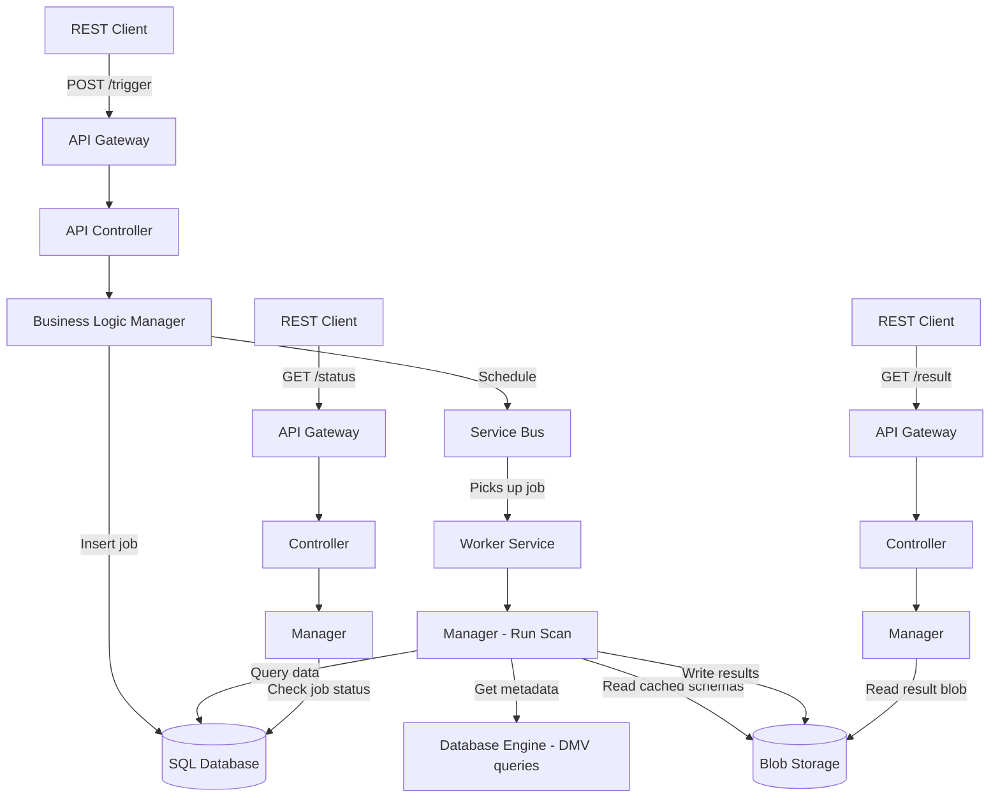

# Use Cases & Vision


Real-world use cases, future ideas, and a case study demonstrating deep architecture exploration in minutes.

---

## Quick Reference: Which Tool Do I Need?

```
Need to find something?
├── Know the FILE NAME?        → search_fast       (~35ms)
├── Know the CLASS or METHOD?  → search_definitions (~1ms)
├── Need a CALL CHAIN?         → search_callers     (<1ms)
├── Need TEXT CONTENT?         → search_grep        (~1ms)
├── Need FILE COUNT only?      → search_grep countOnly=true
└── Not sure?                  → search_help
```

---

## Real-World Use Cases

### 🐛 1. Debugging — Stack Trace Investigation

**Situation:** You receive a production stack trace.

```
NullReferenceException at OrderManager.ProcessOrderAsync(OrderManager.cs:145)
```

<table>
<tr><th>❌ Without search-index</th><th>✅ With search-index</th></tr>
<tr><td>

```
search_files "ProcessOrderAsync"  → 46s
read_file OrderManager.cs         → 2s
search_files "calls ProcessOrder" → 46s
read_file caller file              → 2s
───────────────────────────────────
Total: ~2 minutes + manual analysis
```

</td><td>

```json
// 1. Find method at line 145 (1ms)
{"file": "OrderManager.cs", "containsLine": 145}
→ ProcessOrderAsync (lines 120-160), class: OrderManager

// 2. Trace callers (< 1ms)
{"method": "ProcessOrderAsync", "class": "OrderManager", "depth": 3}
→ OrderController.CreateOrder (line 56)
    └── OrderManager.ProcessOrderAsync (line 145)
        └── PaymentService.ChargeAsync (line 89)

// 3. Read source inline (1ms)
{"name": "ProcessOrderAsync", "includeBody": true}
→ full method source code returned
───────────────────────────────────
Total: 3 milliseconds
```

</td></tr>
</table>

**Speedup: ~40,000×**

---

### 🏗️ 2. Understanding Unfamiliar Code

**Situation:** You need to work on a module you've never seen before.

```json
// Step 1: Map all classes (1ms)
{"name": "PaymentModule", "maxResults": 50, "includeBody": false}
→ PaymentService, IPaymentGateway, PaymentValidator, PaymentController...

// Step 2: Trace call chain from API to data layer (<1ms)
{"method": "ProcessPayment", "class": "PaymentService", "depth": 5, "direction": "down"}
→ PaymentService.ProcessPayment
    ├── PaymentValidator.ValidateRequest
    ├── PaymentGateway.ChargeAsync
    │   └── HttpClient.PostAsync
    └── OrderRepository.UpdateStatusAsync
        └── DbContext.SaveChangesAsync

// Step 3: Find all implementations (1ms)
{"baseType": "IPaymentGateway"}
→ StripeGateway, PayPalGateway, MockPaymentGateway

// Step 4: Assess scale (1ms, 46 tokens)
{"terms": "PaymentService", "countOnly": true}
→ 23 files, 47 occurrences
```

**Time saved:** ~40 minutes of manual exploration → **2 minutes**

> See the [Case Study](#case-study-architecture-deep-dive-in-5-minutes) below for a real example.

---

### 📝 3. Code Review — PR Review Assistance

**Situation:** Reviewing a PR — need to understand blast radius.

<table>
<tr><th>❌ Without search-index</th><th>✅ With search-index</th></tr>
<tr><td>

```
"Who else calls this method?"
search_files → 46s
read_file    → 2s
read_file    → 2s
(repeat 3x)  → 3 min

"All implementations?"
search_files → 46s
read_file    → 2s

"Feature flag used elsewhere?"
search_files → 46s
───────────────────
Total: ~8 minutes
```

</td><td>

```json
// "Who else calls this?" (<1ms)
{"method": "UpdateOrder", "class": "OrderService", "depth": 2}
→ 3 callers found in call tree

// "All implementations?" (1ms)
{"baseType": "IOrderService"}
→ OrderService, OrderServiceV2, MockOrderService

// "Feature flag elsewhere?" (1ms)
{"terms": "EnableNewPricing", "substring": true}
→ 7 files, including config + code
───────────────────
Total: <3 milliseconds
```

</td></tr>
</table>

---

### 🔄 4. Safe Refactoring

**Situation:** Rename a method — must find ALL usage sites, including compound identifiers.

```json
// Find all mentions including compound names (1ms)
// e.g., DeleteOrderCacheEntry, m_orderService, IOrderService
{"terms": "OrderService", "substring": true, "showLines": true, "contextLines": 2}
→ 34 files, 89 occurrences (with surrounding code)

// Confirm all callers (<1ms)
{"method": "ProcessOrder", "class": "OrderService", "depth": 5}
→ full caller tree

// Find DI registrations (5ms)
{"terms": "IOrderService,OrderService", "mode": "and"}
→ 3 files where both appear together
```

**Key advantage:** Substring search catches `DeleteOrderServiceCacheEntry` and `m_orderService` — names that exact-token search misses.

---

### 📊 5. Task Scope Estimation

**Situation:** "How long will this take?"

```json
// How many files? (1ms, ~46 tokens in response)
{"terms": "FeatureX", "countOnly": true}
→ 12 files, 31 occurrences

// How complex? (1ms)
{"parent": "FeatureXManager", "kind": "method"}
→ 14 methods

// How deep? (<1ms)
{"method": "ExecuteFeatureX", "class": "FeatureXManager", "depth": 5}
→ call tree shows 3 layers deep, touches 2 external services
```

**Result:** In 30 seconds you know: 12 files, 14 methods, 3 layers deep → "2-3 day task."

---

### 🧪 6. Writing Tests

```json
// Read the code under test (1ms)
{"name": "ProcessOrder", "parent": "OrderManager", "includeBody": true}
→ full method source returned inline

// Discover all dependencies to mock (1ms)
{"parent": "OrderManager", "kind": "field"}
→ IPaymentService, IOrderRepository, ILogger, IValidator

// Find existing test patterns (35ms)
{"pattern": "OrderManagerTest"}
→ tests/OrderManagerTest.cs, tests/OrderManagerIntegrationTest.cs

// Read test examples inline (1ms)
{"file": "OrderManagerTest.cs", "kind": "method", "includeBody": true}
→ all test methods with source code
```

---

### 🔍 7. Configuration & Dependency Discovery

```json
// All NuGet packages (5ms)
{"terms": "PackageReference", "ext": "csproj", "showLines": true}

// All feature flags in configs (3ms)
{"terms": "FeatureFlag", "ext": "xml,config,json"}

// Who depends on my project? (5ms)
{"terms": "MyProject", "ext": "csproj", "mode": "and"}
```

---

### 🕵️ 8. When Was This Error Introduced?

**Situation:** A new error message `"Entry not found for tenant"` appears in production logs. You need to find exactly when and by whom it was introduced.

```json
// Step 1: Verify you're on the right branch (45ms)
{"repo": "."}
→ branch=main, behindMain=0, fetchAge="2 hours ago" ✓

// Step 2: Find which files contain the text (~1ms)
{"terms": "Entry not found for tenant", "phrase": true, "showLines": true}
→ src/Services/EntryService.cs, line 87

// Step 3: Blame the exact lines to find who introduced it (~200ms)
{"repo": ".", "file": "src/Services/EntryService.cs", "startLine": 85, "endLine": 90}
→ line 87: commit abc123de by Alice on 2025-01-10

// Step 4: See who maintains the file (< 1ms from cache)
{"repo": ".", "path": "src/Services/EntryService.cs", "top": 3}
→ Alice (42 commits), Bob (17 commits), Carol (5 commits)

// Step 5: Get full commit context (~2s)
{"repo": ".", "file": "src/Services/EntryService.cs", "from": "2025-01-09", "to": "2025-01-11"}
→ full diff showing the exact lines added
```

**Tools used:** `search_branch_status` → `search_grep` → `search_git_blame` → `search_git_authors` → `search_git_diff`
**Total time:** ~3 seconds. Without search-index: ~10 minutes of `git log`, `git blame`, manual searching.

---

### ⚡ Time Savings Summary

| Scenario | Without | With | Speedup |
|---|---|---|---|
| Single task (20 searches) | ~17 min | ~0.2 sec | **5,000×** |
| Stack trace (1 frame) | ~5 min | ~3 sec | **100×** |
| Code review (10 questions) | ~8 min | ~0.1 sec | **5,000×** |
| Architecture doc | ~40 min | ~2 min | **20×** |
| Task scope estimation | ~5 min | ~30 sec | **10×** |

**In a typical workday:** 5–10 tasks × 15 min saved = **1–2.5 hours saved daily** per developer.

---

## Case Study: Architecture Deep-Dive in 5 Minutes

### Context

We used search-index to reverse-engineer a **large async API system** spanning **3,800+ lines** across multiple layers, which we had never seen before.



### What we discovered in ~5 minutes

Using only `search_definitions`, `search_callers`, and `search_grep`:

1. **Found all API endpoints** — identified async 3-step polling: POST trigger → GET status → GET result
2. **Traced the full async job flow**: Controller → Manager → Job Scheduler → Worker Service → blob write
3. **Mapped the core data retrieval** (~400 lines): DB queries, lineage extraction, parallel schema loading
4. **Traced call chains** from controller down to database engine connections
5. **Discovered the caching pipeline**: engine queries → discovery service → blob cache → API reads cache
6. **Identified sub-object support**: only 2 of 7 entity types support detailed metadata
7. **Built complete architecture diagrams** with Mermaid

### Tools used and timing

```json
// Find controller endpoints (1ms)
{"parent": "ApiController", "kind": "method"}
→ 5 endpoints: PostTrigger, GetStatus, GetResult, GetModified, GetPrerequisites

// Read method bodies (1ms)
{"name": "PostTrigger", "parent": "ApiController", "includeBody": true}
→ full source: validates input → checks throttling → creates job → schedules → returns 202

// Trace who calls the worker method (<1ms)
{"method": "RunScanAsync", "class": "Manager", "depth": 3, "direction": "up"}
→ WorkerService.RunScanRequest → Manager.RunScanAsync

// Find all related classes (1ms)
{"name": "DomainModule", "kind": "class", "maxResults": 50}
→ 41 classes across controller, manager, storage, contracts layers

// Read interface contract (1ms)
{"name": "IManager", "kind": "interface", "includeBody": true}
→ 7 methods: PostScan, GetStatus, GetResult, GetModified, RunScan, CheckThrottle...

// Trace metadata source (1ms per hop, 3 hops)
Manager.GetSchema → SchemaStorage.GetFromBlob → DB.GetBlobReference
→ discovered: schemas are pre-cached in blob, not queried live
```

**Total search time: <10ms.** The rest was reading and reasoning.

### Key insight

All of this was done **without reading any documentation** — purely by navigating code structure through search-index tools. The AST index + call graph + content search, combined with an AI agent's reasoning, turned a multi-day exploration into a 5-minute conversation.

---

## Vision: Future Ideas

### 🔧 Near-term

**Automatic Developer Onboarding** — A bot that answers "I got a bug in CacheManager, where do I start?" by finding the class, its callers, its dependencies, and related tests in 30 seconds.

**PR Impact Analysis** — On every PR, run `search_callers` depth=5 on every changed method. Generate: "This change affects 3 API endpoints and 47 callers."

**Auto-Generated Architecture Docs** — Given a namespace, auto-map all classes, call trees, and generate Mermaid diagrams.

### 🚀 Mid-term

**Live Architecture Map** — Interactive dependency visualization from the full AST index. Heatmap of co-change frequency (correlating with git history).

**Code Archaeology** — "Tell me the story of this feature" by combining search-index with git blame/log.

**Smart Code Review** — Auto-detect pattern violations: "47 other places wrap this in a logging scope — this PR doesn't."

**Tech Debt Tracker** — Find dead code (methods with zero callers), God classes >3000 lines, unused feature flags.

### 🤯 Moonshots

**AI Migration Planner** — Map all DI registrations and dependencies, generate a migration plan with effort estimates.

**Cross-Repo Search** — One query across all repos: frontend → API → backend → database.

**"Explain This Outage"** — Stack trace → method → callers → feature flags → throttling rules → root cause summary.

**"What If" Simulator** — "What breaks if I delete method X?" → full blast radius with affected tests.

---

## Why search-index Makes All of This Possible

**AST index + call graph + inverted text index in one tool** at **<1ms per query** across **65K+ files**.

Without it, each scenario requires minutes of ripgrep per query, manual file navigation, or heavyweight tools like Roslyn/CodeQL with long cold starts.

search-index provides capabilities that previously required an IDE with a fully-loaded solution — but accessible via MCP in the working flow of an AI agent.
